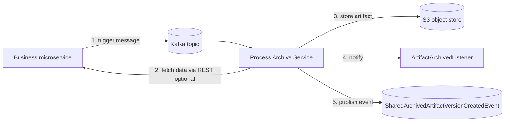

# Architecture

The Process Archive Service (PAS) stores process data for traceability and audit purposes. It is a
reusable microservice template that is instantiated per business application: each business application
runs its own PAS instance built from the `jeap-process-archive-*` libraries.

Archiving is triggered by Kafka messages (domain events or commands). Every archived record is
identified by a *reference id* and, optionally, a *version*. The reference id should ideally be globally
unique, but at least unique within the context in which the PAS archives data.

## Context

1. A message triggers the archiving of data.
2. The PAS fetches the data to archive from a business microservice via REST (optional — the data can
   also be read directly from the message payload, see [event-carried state transfer](consuming-messages.md)).
3. The PAS stores the data in an S3 object store.
4. The PAS reports the completed archiving to any registered [artifact listeners](archived-artifacts.md).
5. The PAS publishes a [`SharedArchivedArtifactVersionCreatedEvent`](archived-artifacts.md).

## Runtime view

In the standard flow (*event notification*) the PAS is triggered by a message and fetches the process
data to archive from a business microservice via REST. In the alternative flow (*event-carried state
transfer*) the message already contains the data and the PAS extracts it directly, with no REST call.

The PAS then produces archiving metadata, stores it together with the process data in the object store,
and derives further object metadata from the store. All information around one archiving operation
(process data, metadata, object metadata) is accumulated in an **archived artifact** and exposed through
an internal listener interface.

Archiving is **synchronous**, so the PAS needs no database of its own for the core flow (a database is
only required for [backfill](backfill.md)). If something fails — S3 unavailable, the source REST call
times out, etc. — the message is not lost: the retry mechanism of the
[jEAP Messaging error handling](https://github.com/jeap-admin-ch/jeap-messaging) takes over. Because
delivery is at-least-once, archiving is retried on failure; already-stored artifacts may be written
again (a new S3 object version) and their events re-published on retry.

## Module map

The PAS is a multi-module Maven project. A PAS instance depends on a subset of these modules (see
[Getting started](getting-started.md)):

| Module                                            | Purpose                                                                                                                                                                                                                                                   |
|---------------------------------------------------|-----------------------------------------------------------------------------------------------------------------------------------------------------------------------------------------------------------------------------------------------------------|
| `jeap-process-archive-domain`                     | Core domain: archive orchestration, configuration lookup, schema validation, backfill domain                                                                                                                                                              |
| `jeap-process-archive-plugin-api`                 | SPI interfaces a PAS instance implements (`MessageArchiveDataProvider`, `ArchiveDataReferenceProvider`, `ArtifactArchivedListener`, `ArchiveDataCondition`, `MessageCorrelationProvider`, `HashProvider`, `ObjectStorageStrategy`, `ArchiveTypeProvider`) |
| `jeap-process-archive-service`                    | Spring Boot application entry point (`ProcessArchiveApplication`)                                                                                                                                                                                         |
| `jeap-process-archive-service-instance`           | Maven parent for a deployable PAS instance                                                                                                                                                                                                                |
| `jeap-process-archive-adapter-kafka`              | Kafka consumer (message ingestion) and producer (artifact event, backfill command)                                                                                                                                                                        |
| `jeap-process-archive-adapter-objectstorage`      | S3 storage via the AWS SDK                                                                                                                                                                                                                                |
| `jeap-process-archive-adapter-crypto`             | Payload encryption via jEAP Crypto                                                                                                                                                                                                                        |
| `jeap-process-archive-adapter-db`                 | Database adapter for [backfill](backfill.md) jobs/tasks                                                                                                                                                                                                   |
| `jeap-process-archive-adapter-rest-api`           | REST API (backfill job submission/report)                                                                                                                                                                                                                 |
| `jeap-process-archive-adapter-opensearch`         | Optional [OpenSearch](opensearch.md) index integration                                                                                                                                                                                                    |
| `jeap-process-archive-remote-data-provider`       | HTTP client for fetching archive data from a source service                                                                                                                                                                                               |
| `jeap-process-archive-config-repository`          | Loads `messages.json` archive configuration                                                                                                                                                                                                               |
| `jeap-process-archive-config-type-repository`     | Loads config-defined (non-Avro) archive types                                                                                                                                                                                                             |
| `jeap-process-archive-type-registry`              | Archive type descriptors and Avro schema handling                                                                                                                                                                                                         |
| `jeap-process-archive-web`                        | Transparent Avro-over-REST HTTP message converter (used by source services)                                                                                                                                                                               |
| `jeap-process-archive-avro-maven-plugin`          | Generates Java bindings from an [Archive Type Registry](archive-type-registry.md)                                                                                                                                                                         |
| `jeap-process-archive-type-registry-maven-plugin` | Validates an Archive Type Registry at build time                                                                                                                                                                                                          |
| `jeap-process-archive-avro-validator`             | Avro schema validation used by the plugins                                                                                                                                                                                                                |

Reading archived artifacts back is provided by the separate
[jeap-process-archive-reader](reading-archived-data.md) library.

## Related

- [Getting started](getting-started.md)
- [Consuming messages](consuming-messages.md)
- [Object storage](object-storage.md)
- [Archived artifacts & events](archived-artifacts.md)
- [Configuration reference](configuration.md)
